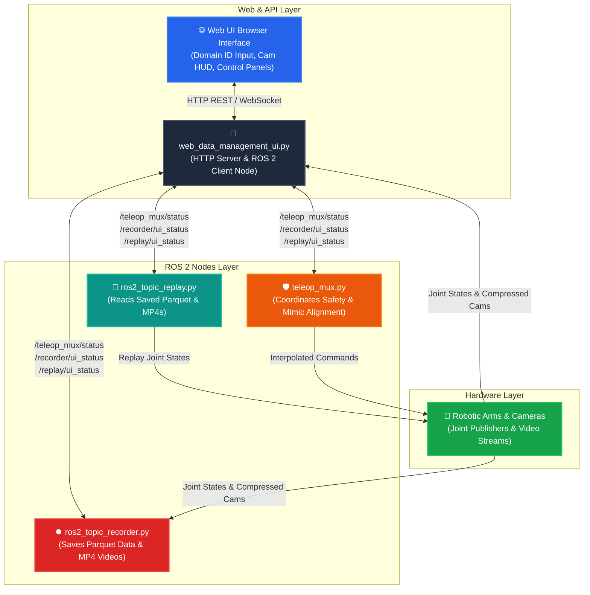

# 🤖 Autonomous Robot Data Collection & Safety Interface (AR-DCSI)

A professional, high-performance ROS 2 and Web GUI framework designed for robotics engineers to record, replay, and manage imitation learning datasets (compatible with local v3-style HDF5/Parquet/MP4 formats) while ensuring safe, smooth physical arm alignment.

AR-DCSI features a custom-built, lock-free **Canvas-based frame polling system** for low-latency video streaming without thread deadlocks, and a **dynamic CycloneDDS peer discovery system** that scans the network to automatically route communication between devices even when their IP addresses change after rebooting.

---

## 📊 System Architecture & Data Flow

Below is the conceptual architecture showing how the Web GUI, ROS 2 Services, and control multiplexers communicate:



---

## ⚙️ Requirements & Prerequisites

To run this framework successfully, the system must meet the following specifications:

### 1. Operating System & Middleware
* **OS**: Ubuntu 22.04 LTS (Jammy Jellyfish)
* **ROS 2**: ROS 2 Humble Hawksbill (Desktop or Base)
* **DDS Middleware**: Eclipse Cyclone DDS (`ros-humble-rmw-cyclonedds-cpp`)

### 2. System Utilities
* **nmap**: Required for automated, dynamic network scanning of DDS peers.
  ```bash
  sudo apt-get update && sudo apt-get install -y nmap
  ```

### 3. Python Packages
Install the required packages using pip:
```bash
pip3 install opencv-python pandas pyarrow pyyaml tornado numpy pillow
```

### 4. Hardware/Network Environment
* A local router/switch forming a robot subnet (typically `192.168.200.x`).
* Network interface cards (NIC) on the workstation/robot connected to this subnet.
* Up to 4 camera sources publishing `sensor_msgs/msg/CompressedImage` messages.

---

## 📂 File Structure & Purpose

| Directory / File | Purpose | Main Responsibilities |
| :--- | :--- | :--- |
| **`start_data_collection.sh`** | Startup Launcher Script | Orchestrates system initialization. Sets up dynamic CycloneDDS discovery, reads configurations, cleans stale processes, and starts the Web UI. |
| **`web_data_management_ui.py`** | Web GUI Server & Backend API | Hosts the HTML/CSS control console, manages active camera frame subscriptions, spawns replay overlay threads, validates Domain IDs, and runs 10Hz background status synchronization. |
| **`ros2_topic_recorder.py`** | Data Collection Recorder | Listens to joint states and cameras, saves them to Parquet format and chunked MP4 videos, handles `/recorder/start` & `/recorder/stop` services, and publishes `/recorder/ui_status` for live progress tracking. |
| **`ros2_topic_replay.py`** | Dataset Playback | Reads recorded Parquet files and MP4 videos, publishes joints to mimic leader frames, manages `/replay/start` & `/replay/stop` services, and publishes `/replay/ui_status` to synchronize video playback on the UI. |
| **`teleop_mux.py`** | Safety Multiplexer | Coordinates safety transitions between 4 states: `HOLD` (prevent gravity fall), `REPLAY` (lock joints), `MIMIC_ALIGN` (smooth S-curve interpolation to align with leader), and `MIMIC` (live mimicking). |
| **`ros_diagnostics.py`** | Stream Diagnostic Tool | Listens to camera streams on a specific Domain ID for exactly 125 seconds and outputs frequency (Hz) and size (KB) metrics in a formatted report. |

---

## 🌐 Dynamic Networking (CycloneDDS Peer Discovery)

When devices (such as the robot and the control laptop) power off and on, their IP addresses on the local network (e.g., `192.168.200.x`) often change. If DDS uses hardcoded peer lists, communication breaks.

To solve this, **AR-DCSI** features automated network scanning in the `start_data_collection.sh` script:

1. **Subnet Matching**: The script detects the active local interface (NIC) assigned to the `192.168.200.x` subnet.
2. **Nmap Scan**: It performs an optimized, ultra-fast ping scan on the subnet (`nmap -sn -T4 --max-rtt-timeout 150ms 192.168.200.0/24`) to find all online hosts within 1.5 seconds.
3. **Broadcast & ARP Fallback**: If `nmap` is unavailable, it pings the subnet broadcast address (e.g., `192.168.200.255`) and reads the local ARP cache (`ip neighbor show`).
4. **Auto-Configuration**: It constructs a dynamic `<Peers>` list containing all active IPs and exports it to `CYCLONEDDS_URI` before starting ROS 2 nodes, ensuring instant, configuration-free communication.

---

## 🔧 Configuration Setup (`config.yaml`)

Edit your settings in `daksha_data_collection/config/config.yaml`. Below is a standard profile:

```yaml
domain_id: 3  # Global ROS 2 Domain ID
dataset:
  root_dir: /home/s1/.ihub/.barani/gen2_full/src/ui/Clients_UI/daksha_data_collection/datasets
  dataset_name: Box_pick_and_place
  task: pick_object
  prompt: "Pick up the red block"

recording:
  record_hz: 30.0     # Recording frequency (Hz)
  episode_len: 500    # Maximum steps per episode

recording_topics:
  leader_topic_left: /leader/left_joint_states
  leader_topic_right: /leader/right_joint_states
  follower_topic_left: /LeftArmSystem_ordered_joint_states
  follower_topic_right: /RightArmSystem_ordered_joint_states
  camera_topics:
    left_wrist: /left_arm/left/color/image_raw/compressed
    right_wrist: /right_arm/right/color/image_raw/compressed
    binocular_left: /zed/zed_node/left/image_rect_color/compressed
    binocular_right: /zed/zed_node/right/image_rect_color/compressed
```

---

## 🚀 Execution Steps & Guidance

### Step 1: Compile the ROS 2 Workspace
First, navigate to the `final/` directory, compile the ROS 2 packages using `colcon`, and source the setup environment:
```bash
cd Clients_UI/final
colcon build --packages-select daksha_data_collection daksha_msgs
source install/setup.bash
```

### Step 2: Launch the Web UI and Backend Services
Run the custom startup script. It will clean up older running services, build the dynamic CycloneDDS peer list, and launch the Web UI:
```bash
./start_data_collection.sh
```
*The script will dynamically detect the machine's local/network IP addresses and automatically attempt to open your browser to the preferred address (e.g., `http://192.168.200.115:8080` or `http://localhost:8080`).*

### Step 3: Configure & Register Camera Streams
1. Open the Web UI in your browser at the address printed in the console dashboard (e.g., `http://<HOST_IP>:8080` or `http://localhost:8080`).
2. Click **"Load Topics"** with the active Domain ID.
3. Under **Live Camera Feeds**, click **"+ Add Camera"** and configure your camera topic names:
   * **CAM 1**: `world_left` ➡️ `/zed/zed_node/left/color/raw/image/compressed`
   * **CAM 2**: `world_right` ➡️ `/zed/zed_node/right/color/raw/image/compressed`
   * **CAM 3**: `wrist_left` ➡️ `/left_arm/left/color/image_raw/compressed`
   * **CAM 4**: `wrist_right` ➡️ `/right_arm/right/color/image_raw/compressed`
4. Click **"Save Config & Register All"** to display live video streams on the Canvas HUD.

---

## 📋 Demonstration Workflow (Data Collection Cycle)

### 1. Aligning the Arms (Safety System)
Before recording, you must align the follower arms with the leader arms to avoid sudden jerks:
* Click **"MIMIC_ALIGN"** on the UI (or trigger `/teleop_mux/mimic`).
* The Safety Multiplexer (`teleop_mux.py`) will perform a smooth S-curve interpolation to move the follower joints to match the leader's position.
* Once aligned, the system enters **`MIMIC`** mode, allowing you to control the robot.

### 2. Recording Demonstrations
* Click **"Start Recording"** (or use the hotkey `R`).
* The recorder captures joint trajectories and compressed camera frames at the frequency specified by `record_hz`.
* The progress bar on the Web UI updates in real-time (`Steps: X / Max Steps`).
* Once the episode length is reached, recording automatically stops and saves the files as a Parquet dataset and synced MP4 videos inside your target root directory.

### 3. Replaying and Validating Episodes
* Click **"Start Replay"** on the Web UI.
* The replay node loads the recorded joints and plays them back through the robot interface.
* The Web HUD overlays the replayed camera frames, showing a blinking **`🔴 REPLAY`** badge so you can check demonstration quality.

---

## 💻 Terminal Service Controls

You can also control the entire recording and safety multiplexer pipeline via direct ROS 2 command terminal calls:

### ⏺️ Trigger Recording
```bash
export ROS_DOMAIN_ID=111
ros2 service call /recorder/start ros_pkg_msgs/srv/StartRecord "{dataset_name: 'terminal_demo', episode_length: 200, record_hz: 20.0, max_episodes: 1}"
```

### 🔄 Trigger Replay
```bash
export ROS_DOMAIN_ID=111
ros2 service call /replay/start ros_pkg_msgs/srv/StartReplay "{dataset_name: 'terminal_demo', episode_index: 0, speed: 1.0}"
```

### 🛑 Stop Replay
```bash
export ROS_DOMAIN_ID=111
ros2 service call /replay/stop std_srvs/srv/Trigger
```

### 🛡️ Switch Safety Modes
* **Start Mimic control (Follow Leader)**:
  ```bash
  ros2 service call /teleop_mux/mimic std_srvs/srv/Trigger
  ```
* **Force Lock Position (Hold)**:
  ```bash
  ros2 service call /teleop_mux/hold std_srvs/srv/Trigger
  ```

---

## 📊 Stream Diagnostics

To run network analysis or test stream latency/frequency, execute the following script (listens to streams on Domain ID `18` for 125 seconds):
```bash
python3 daksha_data_collection/daksha_data_collection/ros_diagnostics.py
```
This utility outputs a detailed table displaying frame rates (Hz) and size profiles (KB) for active video channels.
